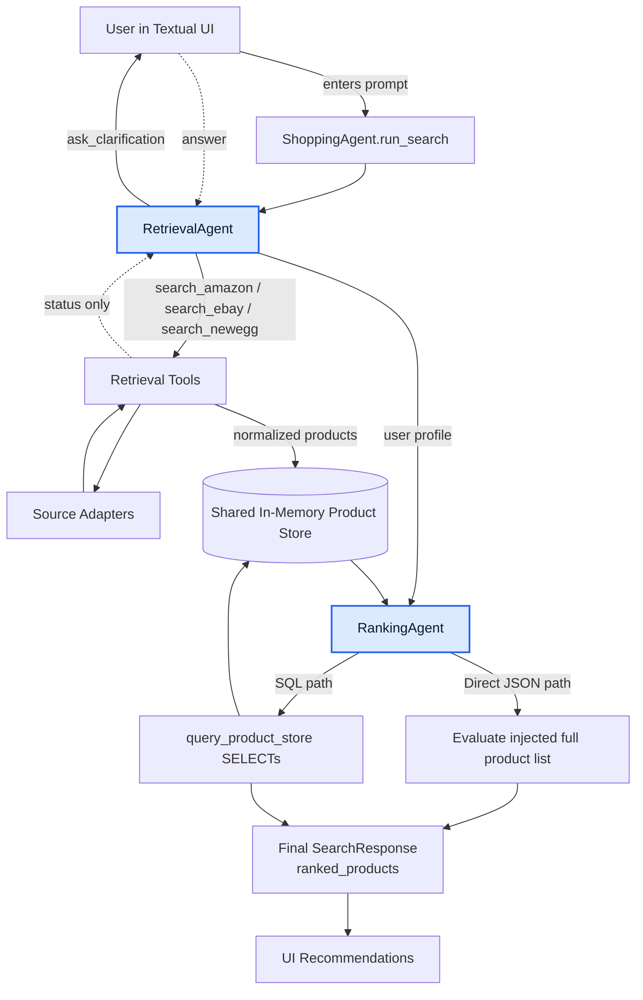
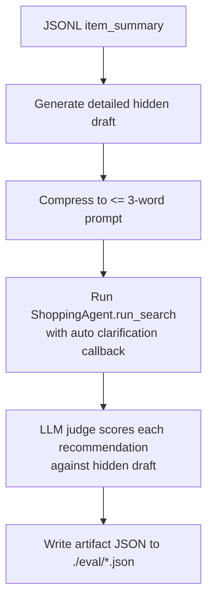

# Shopping Agent Backbone

Terminal-first scaffold for an interactive shopping agent project. The current architecture is a two-agent OpenAI SDK harness:

- `RetrievalAgent` handles clarification and source-specific search tool calls
- `RankingAgent` handles final top-10 scoring through either direct JSON injection or a shared in-memory SQLite product store

## Included

- Textual terminal UI with launch input, loading state, clarification popups, ranked results, logs, and browser-openable rows
- OpenAI Python SDK harness with runtime tool registration for `ask_clarification`, `search_amazon`, `search_ebay`, and `search_newegg`
- Shared normalized `Product` schema and centralized in-memory product store
- Two ranking comparison paths that match the project plan:
  - direct JSON ranking
  - SQL-backed ranking
- Evaluation harness skeleton for synthetic demand generation and system comparison

## Not Included

- Real Amazon scraping or API integration guarantees
- Production persistence
- Final evaluator-LLM workflow for the course benchmark

## UV Workflow

```bash
uv sync
uv run shopping-agent --config config.yaml
```

Use `--limit` to cap how many products each scraper returns for a search:

```bash
uv run shopping-agent --config config.yaml --limit 10
```

Use the SQL-backed ranking path with:

```bash
uv run shopping-agent --config config.yaml --sql
```

Run JSONL-driven evaluation artifacts with:

```bash
uv run shopping-agent-eval --config config.yaml --input items.jsonl --out-dir ./eval
```

Use `--head` to open a visible browser window instead of the default headless mode:

```bash
uv run shopping-agent --config config.yaml --head
```

The config file only needs the SDK connection for the shared agent model:

```yaml
agent:
  openai_base_url: "https://api.openai.com/v1"
  openai_model_id: "gpt-4.1"
  openai_api_key: "sk-..."
```

## Test

```bash
uv run pytest
```

## Notes

- The TUI popup flow is driven by the agent's `ask_clarification` tool call rather than by hard-coded question logic.
- Retrieval tools append normalized `Product` rows into a shared in-memory store but return only compact status payloads back to `RetrievalAgent`.
- `RankingAgent` never asks follow-up questions.
- Direct JSON ranking is the default launch mode. Pass `--sql` to switch to the SQLite-backed comparison path.

## Architecture Flow

User flow through the system



LLM judge evaluation pipeline



## Project Layout

```text
src/shopping_agent/
  agent/
  evaluation/
  main.py
  retrieval/
  ui/
tests/
```
